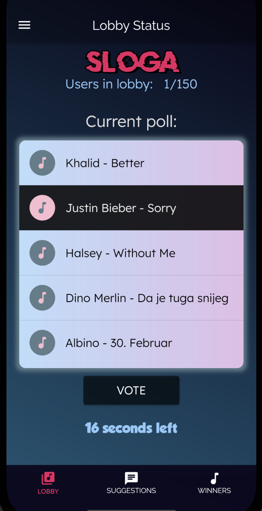

# MyDJ App

The full Documentation for this application is 32 pages long. 
You can find it in the repository as "Documentation.pdf".

The Video Demonstration can be found on this link: https://www.youtube.com/watch?v=mOkoiI_u_wU

## ABSTRACT

Many parts of our everyday lives have been digitized, but there is one part that has not. Almost every person found themselves in a situation where they would go out to enjoy a night with their friends but the music being played would just not fill their needs or suit their taste. Adding the digital factor, in the form of a mobile application, would solve this problem. MyDJ app brings democracy to the table and lets everyone have their say for the next song that will be played that night. Every person attending a certain event, would be able to join the event’s lobby with their provided lobby code. Inside that lobby, the DJ for the night creates dynamic polls where users are able to vote for a song they prefer the most. The most voted song gets played next and so on, until the end of the event. This would refresh and raise the standard of events that are based on listening and dancing to music in public. It would bring a new dynamic to both the owner and the customer and make everything more fun in general. The technologies used for development were Flutter and Dart for the frontend of the application and Firebase for the backend and the service side of the application. The app works for both Android and iOS.

## SCREENSHOT

### LobbyUser Screen

